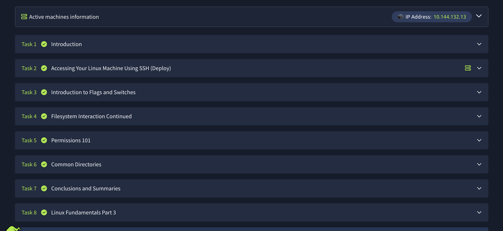

### Linux Fundamentals Part 2 — What I Learned

* **File & directory management**

  * `touch` → create an empty file
  * `mkdir` → create a directory
  * `cp` → copy files/directories
  * `mv` → move or rename files/directories
  * `rm` → delete files
  * `rm -R` → recursively delete directories
  * `file` → identify a file's type
  * Commands can use **full file paths**.

* **Linux permissions**

  * Permissions control what users can **read (`r`), write (`w`), and execute (`x`)**.
  * Permissions are divided into **owner, group, and others**.
  * Numeric permissions:

    * `r = 4`
    * `w = 2`
    * `x = 1`
  * Examples:

    * `755` → owner: `rwx`, group/others: `r-x`
    * `644` → owner: `rw-`, group/others: `r--`
    * `700` → owner has full access; everyone else has none
  * `chmod` can modify permissions.

* **Users & groups**

  * Linux permissions can give different access levels to the **file owner, groups, and other users**.
  * `su` → switch to another user.
  * `su -l user` → switch user and load their login environment/home directory.

* **Important Linux directories**

  * `/etc` → system configuration files, including `passwd`, `shadow`, and `sudoers`.
  * `/var` → variable data such as logs in `/var/log`.
  * `/root` → home directory of the root user.
  * `/tmp` → temporary files; commonly writable by users and useful for storing temporary tools/scripts during security labs.

### 🔑 Key takeaway

**Part 2 taught me how to manage files/directories, understand Linux permissions and users, switch between accounts, and recognize important filesystem locations. These are fundamental skills for Linux administration and cybersecurity.**
