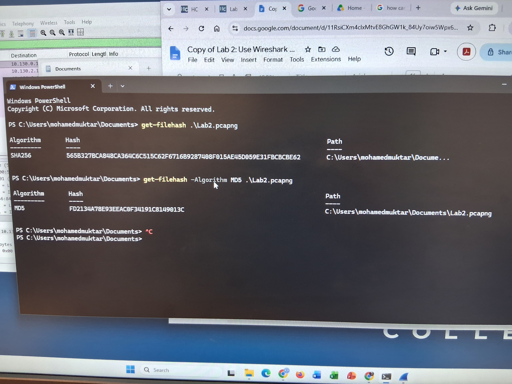

# Lab 2 – Use Wireshark to Examine Ethernet Frames

## Objective

To examine Ethernet II frame headers and use Wireshark to capture and analyze local and remote network traffic.

## What I Did

- Examined Ethernet II frame fields, including source and destination MAC addresses, frame type, and data.
- Used `ipconfig` to identify my PC's IP address and default gateway.
- Captured network traffic using Wireshark and filtered packets using ICMP.
- Analyzed ARP requests and replies to understand how devices discover MAC addresses.
- Used ping to test connectivity to the default gateway and `www.cisco.com`.
- Compared MAC and IP addresses for local and remote traffic.
- Saved a packet capture and generated SHA-256 and MD5 hashes to verify file integrity.

## Key Findings

- ARP resolves IPv4 addresses to MAC addresses on a local network.
- ICMP is used for network diagnostics, such as ping.
- Remote traffic uses the default gateway's MAC address while retaining the remote host's destination IP address.
- Hash values help verify file integrity during forensic investigations.

## Conclusion

I learned how to capture and analyze Ethernet frames using Wireshark, identify MAC and IP addresses, understand ARP and ICMP traffic, and use hash functions to verify packet capture integrity.